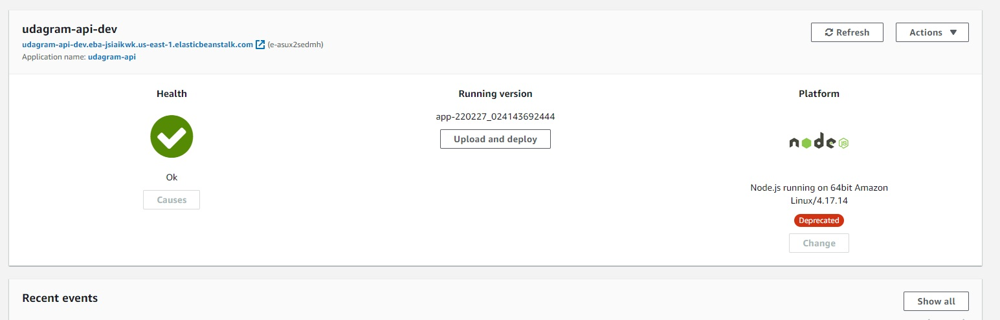
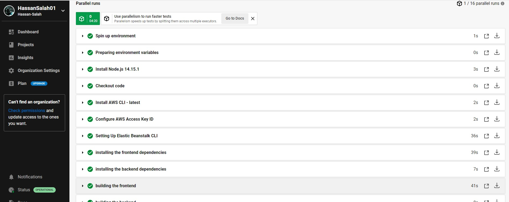
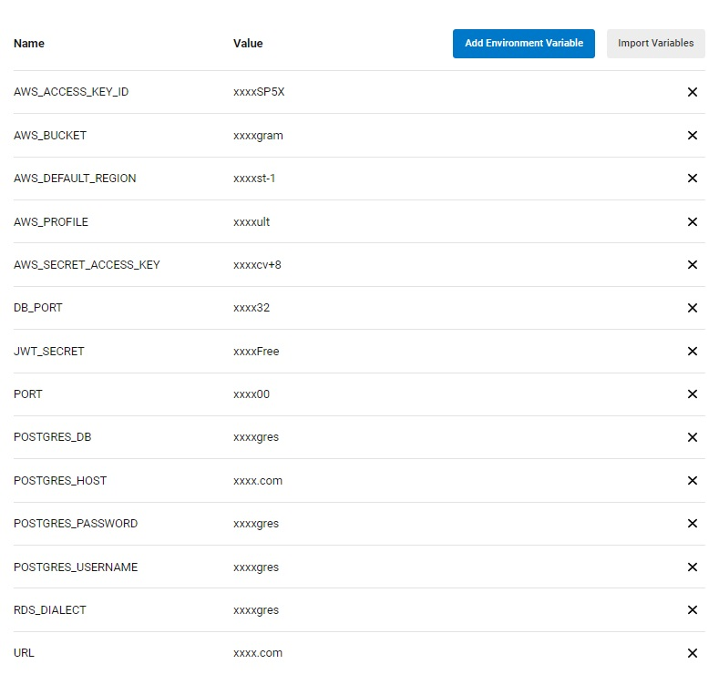
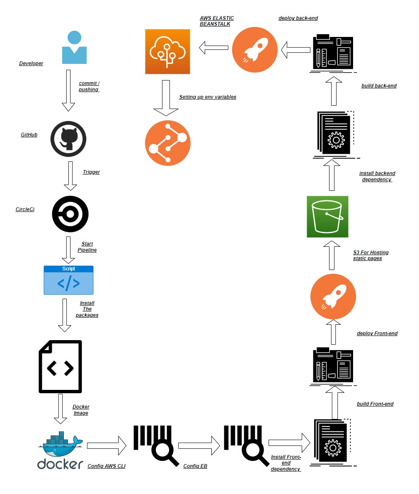

# Udagram   [](https://app.circleci.com/pipelines/github/HassanSalah01/udagram/29/workflows/db289618-ddcb-426b-b979-54049af4f74c/jobs/31)

## _A Udacity Project For Deploying An application Through AWS_


```

This is a full-stack web application that   
represent a social media application which let the user
post photos and share them , this starter code  was given by udacity,
and the task was to deploy the application To aws using The following

```

# Perview


# links 

RDS : postgress :  database-1.cflqendfokau.us-east-1.rds.amazonaws.com

S3 Bucket : http://pro-udagram.s3-website-us-east-1.amazonaws.com

Elastic beanstalk : http://udagram-api-dev.eba-jsiaikwk.us-east-1.elasticbeanstalk.com/


# OverView 

## DataBase 


# S3


# Elastic BeanStalk





# CircleCi Accepted PipeLine:



# CircleCi Environment variable :



# Dependencies

* Nodejs v14.15.1 Or the latest version While older version can still Works fine but we recommend the latest release of node 
[Nodejs Download link ](https://nodejs.org/en/download/)
* npm 7.14.8 Or the latest version , you can also use yarn but You need to change The Scripts included From  NPM to yarn 
* AWS CLI v2 or the Latest version 
[AWS CLI Download link ](https://docs.aws.amazon.com/cli/latest/userguide/getting-started-install.html)  
* You can actually do everything Using AWS Cli But We Also recommend Eb cli it is much easier and helpful [EB CLI Download link ](https://docs.aws.amazon.com/elasticbeanstalk/latest/dg/eb-cli3-install.html)  
* You need An Elastic Beanstalk For Hosting Your backEnd Server 
[Amazon Elastic Beanstalk ](https://aws.amazon.com/elasticbeanstalk/)  
 * You will Also Need An S3 Bucket To Host your static pages and The 
 [Amazon S3 ](https://aws.amazon.com/s3/) uploaded Pictures captures by the user 
* And Finally you Will need to use RDS service To create Our DATABASE Which in this Case Is Postgres
[Amazon Rds](https://aws.amazon.com/rds/)  


## Project Infrastructure :

- RDS : We Are using RDS service Provided by Aws To great a relational Database 
- S3 bucket : WE are using s3 bucket To host 2 different Thing 
	* A ) our front-end Static web pages Which is made by using Angular 
	* B ) The Pictures posted by the user When he use our website
- Elastic Beanstalk : this is where we host our backend and that act like our backend server 
Which we use with node js environment with typescript and express


# PipeLine Process 
## When The Developer Commit And Push The Code To GitHub :

1. CircleCI Script Will be triggered To start The process 
2. it will always checkout the code To see If there is a difference 
3. it will install all the packages Your need For Our Example here it will install node 
4. it will install AWS-Cli 
5. it will install Eb-Cli 
6. it will start configure The Aws Access Key Id ( which is passed as an env Variable Through The CircleCi ) 
7. it will start Setting Up Eb Cli To elastic beanstalk 
8. it will start Installing Dependencies needed For the frontEnd through our package.json file 
9. it will start Installing Dependencies needed For the BackEnd through our package.json file 
10. it will start building The Front-End To output Us Our WWW file To be deployed 
11. it will start building The back-End To output Us Our WWW file To be deployed 
12. it will Start Deploying our FrontEnd build To our S3 bucket For static webPages
13. it will start deploying our backend Build to Our elastic Beanstalk 
14. it will configure our Elastic beanstalk Environment variable passed By CIrcle Ci

# PipeLine Process


# Getting started On your local machine 

## Prerequisites
- [Node js]
- [yarn] OR [NPM] 

 1. clone the repo into your local machine 
 2. navigate to The udagram-frontend directory 
 3. run the following command npm install 
 4. navigate to the udagram-api 
 5. run the following command npm install 
 6. Now you need to create your database locally using postgres
 7. create a . env file With these varibles in mind 
 ## Environment
    PORT =3000
    POSTGRES_USER  = your postgress user 
    POSTGRES_DB = your database name FOr dev
    POSTGRES_HOST = localhost
    POSTGRES_PASSWORD = your database pass
    JWT_SECRET = the number of round INTEGER  
8. use Postbird To test the database 
9. now Run the following command npm start 
10. move back to the udagram-frontend 
11. run npm start


## Tech Used :
- [ Angular ]
- [ Postgres]
- [ Express ]  
- [ Jasmine ] 
- [ Nodejs ] 
- [ AWS ] 
