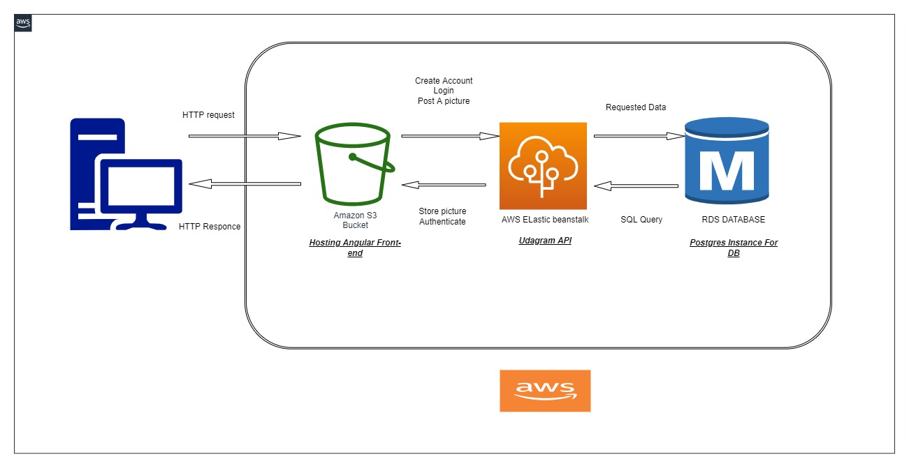

## Project Infrastructure :

- RDS : We Are using RDS service Provided by Aws To great a relational Database 
- S3 bucket : WE are using s3 bucket To host 2 different Thing 
	* A ) our front-end Static web pages Which is made by using Angular 
	* B ) The Pictures posted by the user When he use our website
- Elastic Beanstalk : this is where we host our backend and that act like our backend server 
Which we use with node js environment with typescript and express

