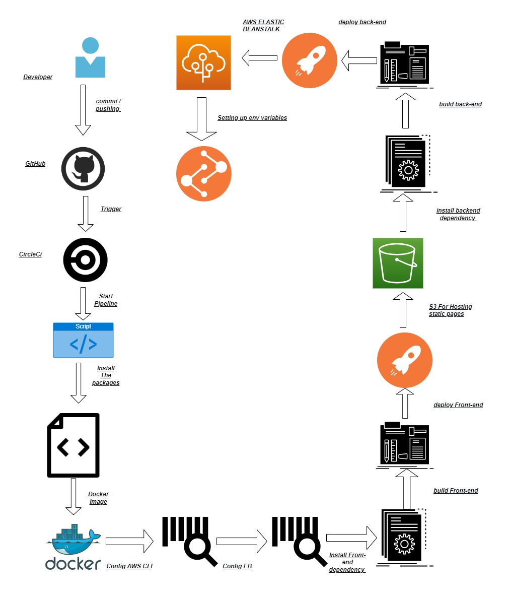
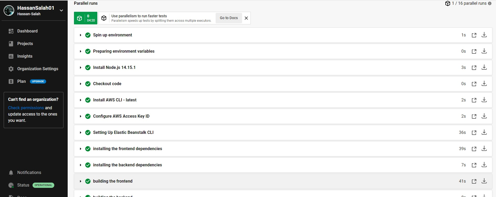
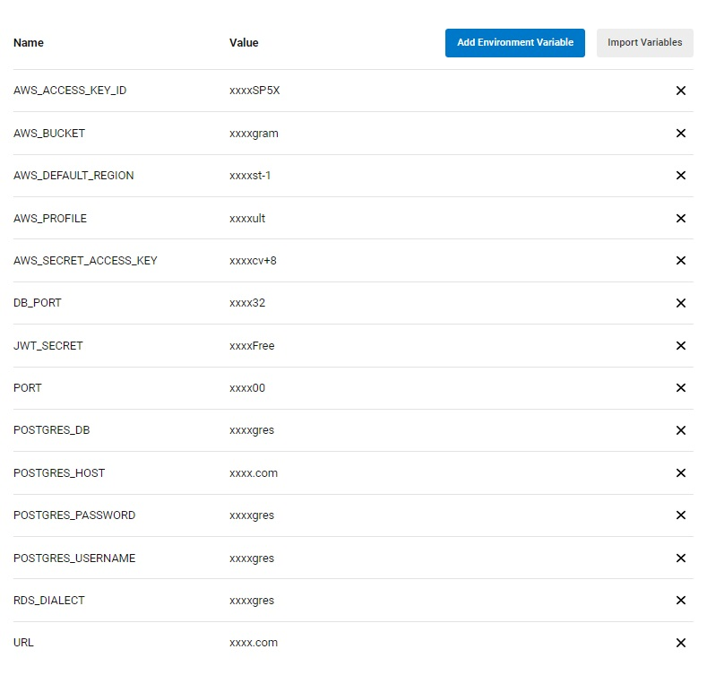

# PipeLine Process 
## When The Developer Commit And Push The Code To GitHub :

1. CircleCI Script Will be triggered To start The process 
2. it will always checkout the code To see If there is a difference 
3. it will install all the packages Your need For Our Example here it will install node 
4. it will install AWS-Cli 
5. it will install Eb-Cli 
6. it will start configure The Aws Access Key Id ( which is passed as an env Variable Through The CircleCi ) 
7. it will start Setting Up Eb Cli To elastic beanstalk 
8. it will start Installing Dependencies needed For the frontEnd through our package.json file 
9. it will start Installing Dependencies needed For the BackEnd through our package.json file 
10. it will start building The Front-End To output Us Our WWW file To be deployed 
11. it will start building The back-End To output Us Our WWW file To be deployed 
12. it will Start Deploying our FrontEnd build To our S3 bucket For static webPages
13. it will start deploying our backend Build to Our elastic Beanstalk 
14. it will configure our Elastic beanstalk Environment variable passed By CIrcle Ci

# PipeLine Process

# CircleCi Accepted PipeLine:

# CircleCi Environment variable :
